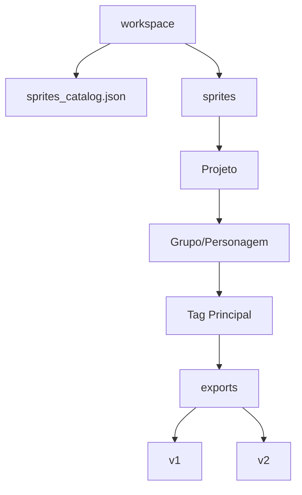

# Guia do Usuário - VLV Sprite Organizer

Bem-vindo ao **VLV Sprite Organizer**, sua ferramenta premium para gerenciamento, fatiamento e visualização de *Sprite Sheets*. Projetado para desenvolvedores de jogos e artistas, este sistema simplifica o fluxo de trabalho entre a criação de assets e a implementação na engine.

---

## Visão Geral do Sistema

O **VLV Sprite Organizer** permite que você:
- **Fatie** Sprite Sheets complexas com precisão.
- **Visualize** animações em tempo real com controles de FPS e Zoom.
- **Organize** seus assets por Projeto, Grupo e Personagem.
- **Exporte** com versionamento automático (v1, v2, v3...) para manter o histórico de alterações.
- **Converta** GIFs animados em sequências de frames ou novas Sprite Sheets.

---

## 1. Acesso e Segurança

Ao iniciar a aplicação, você será recebido pela tela de autenticação. 

> [!IMPORTANT]
> Apenas usuários registrados podem realizar exportações e manter logs de atividades.

### Como Acessar:
1. **Login:** Insira seu Usuário e Senha para entrar.
2. **Criar Conta:** Se for seu primeiro acesso, clique em "Não tem conta? Registre-se" para criar um novo perfil localmente.

---

## 2. Carregamento de Arquivos

No topo da interface, você encontrará o botão principal de carregamento.

1. Clique em **↑ Carregar Sprite Sheet**.
2. Selecione um arquivo de imagem (`.png`, `.jpg`, `.bmp`) ou um **GIF Animado**.
3. O nome do arquivo aparecerá ao lado do botão, indicando que o sistema está pronto.

---

## 3. Configurações de Corte (Slicing)

No painel esquerdo (**Configurações de Corte**), defina como a imagem será dividida:

| Campo | Descrição |
| :--- | :--- |
| **Largura do Frame** | Largura exata em pixels de cada sprite individual (ex: 32). |
| **Altura do Frame** | Altura exata em pixels de cada sprite individual (ex: 32). |
| **Colunas (Opc)** | Quantidade de colunas. Se vazio, o sistema calcula automaticamente. |
| **Linhas (Opc)** | Quantidade de linhas. Se vazio, o sistema calcula automaticamente. |

Após preencher, clique em **Gerar Preview** para fatiar a imagem.

---

## 4. Preview e Controles de Animação

Uma vez gerado o preview, a animação começará a ser exibida no canvas central.

### Controles Disponíveis:
- **Play / Pause:** Controle a reprodução da sequência.
- **FPS:** Ajuste a velocidade da animação em quadros por segundo (padrão: 12).
- **Zoom Preview:** Deslize o slider para aumentar a visualização da sprite em até 10x, perfeito para conferir detalhes de Pixel Art sem perda de nitidez (Nearest Neighbor interpolation).

---

## 5. Exportação e Catálogo

O VLV Sprite Organizer não apenas corta, mas também organiza sua biblioteca de assets.

### Informações de Exportação:
- **Nome do Projeto:** Nome da sua obra (ex: `ProjectPhoenix`).
- **Grupo/Personagem:** Nome do herói, inimigo ou objeto (ex: `Hero_Idle`).
- **Tags:** Palavras-chave separadas por vírgula (ex: `hero, movement, idle`).
  > [!TIP]
  > A primeira tag informada será usada como o nome da subpasta de organização no seu workspace.

### Modos de Exportação:
1. **Frames Cortados:** Salva cada frame como um arquivo `.png` individual numerado (001, 002...).
2. **Sprite Sheet Inteira:** Salva uma nova imagem consolidada (útil para converter GIFs ou reordenar frames).

### Versionamento Automático
Sempre que você clica em **Exportar e Catalogar**, o sistema verifica se já existe uma versão anterior.
- Exportação 1 -> Pasta `v1`
- Exportação 2 -> Pasta `v2`
- ... e assim por diante.

---

## 6. Estrutura do Workspace

Seus arquivos são organizados na seguinte hierarquia dentro da pasta do projeto:

- **`sprites_catalog.json`**: Contém o histórico de todas as exportações, tags e metadados. **Não apague este arquivo manualmente.**

---

## Solução de Problemas

- **A imagem não carrega:** Verifique se o formato é suportado e se o arquivo não está corrompido.
- **Frames desalinhados:** Certifique-se de que a largura e altura do frame coincidem com o desenho original da Sprite Sheet.
- **FPS Lento:** Verifique se não há outros processos pesados utilizando a CPU no momento da pré-visualização.

---
*VLV Sprite Organizer - Desenvolvido para facilitar sua arte.*
